# Sanimex Gam

**Gam** Es una aplicación móvil desarrollada en Kotlin y Jetpack Compose, diseñada para facilitar la gestión de pedidos y la interacción con el catálogo de productos de Sanimex. Permite a los usuarios explorar el catálogo, buscar productos, gestionar un carrito de compras, acceder a información de clientes, visualizar ubicaciones y consultar históricos de cotizaciones, adaptándose a diferentes roles de usuario dentro de la empresa.

Disponible en Google Play.

## Screenshots

   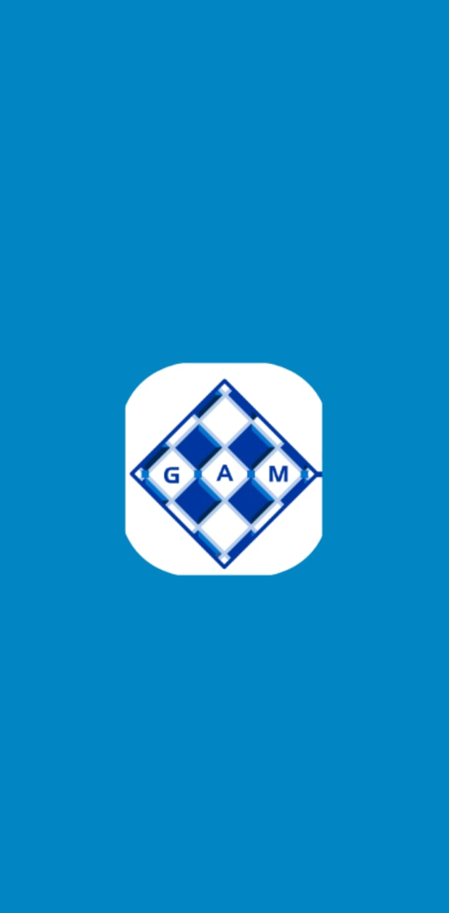
   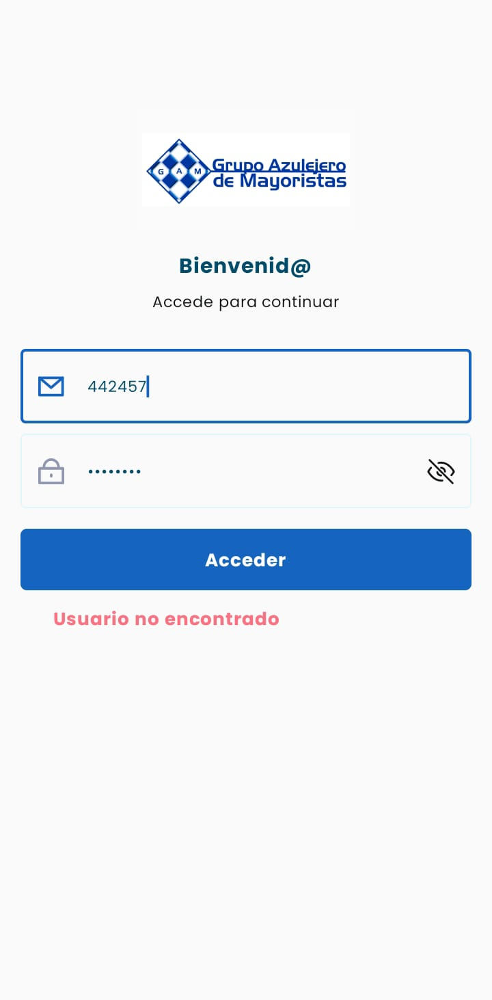
   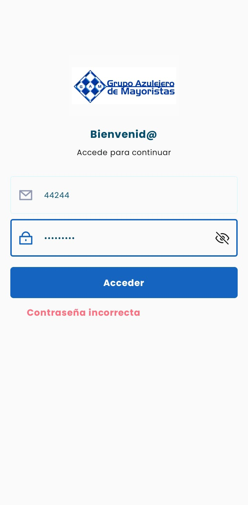
    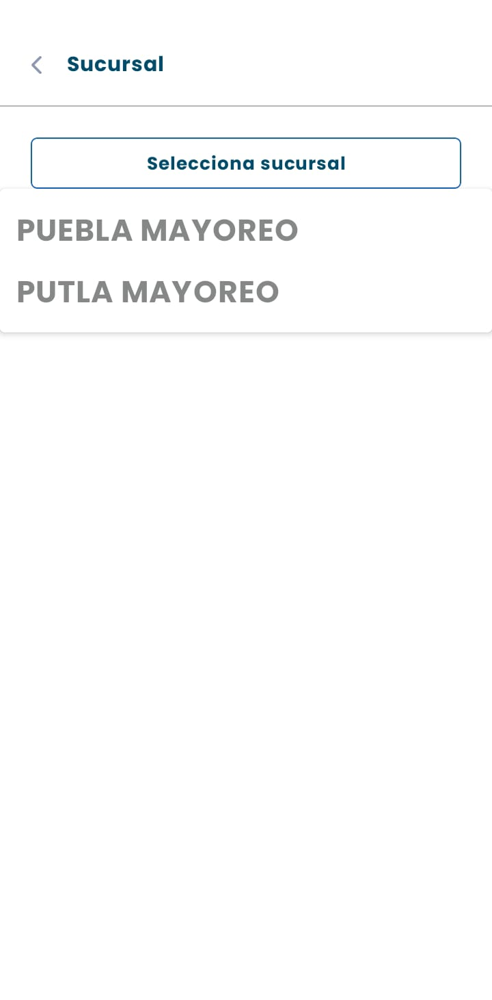
    
  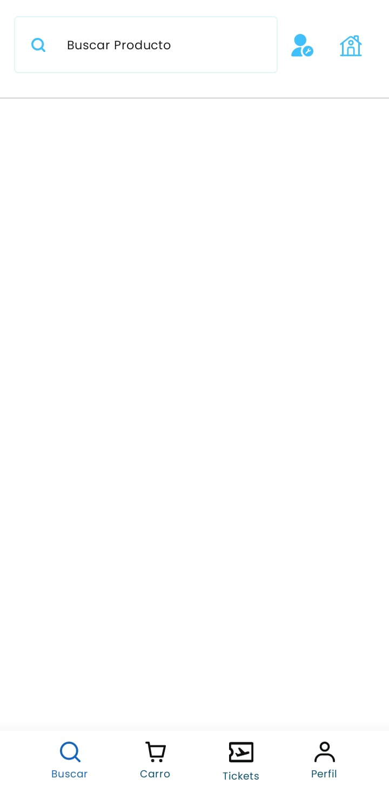
  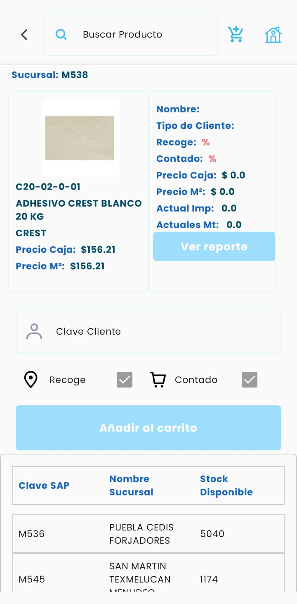
  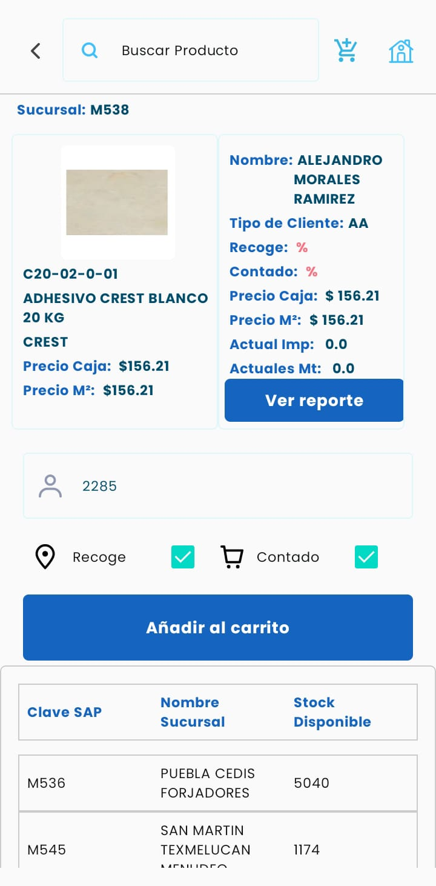
  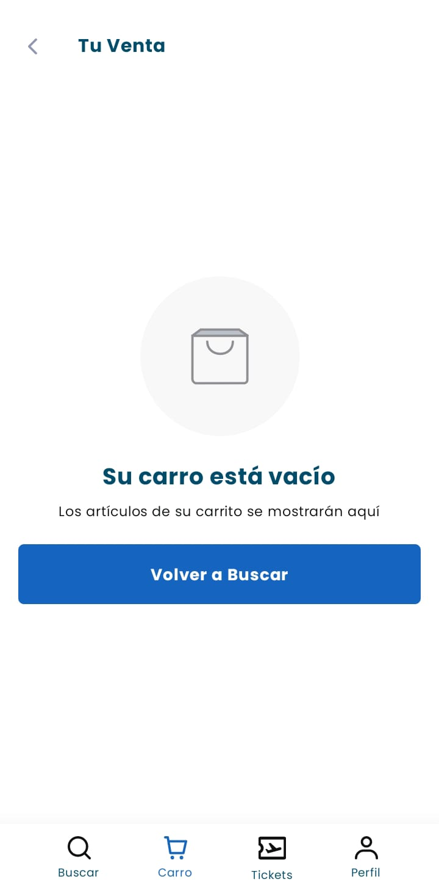
  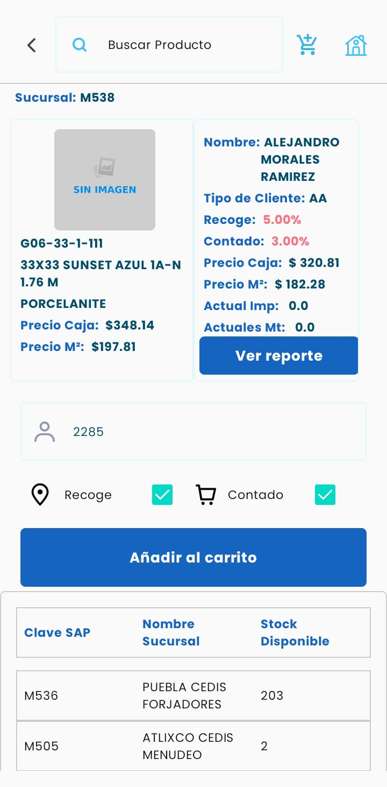
    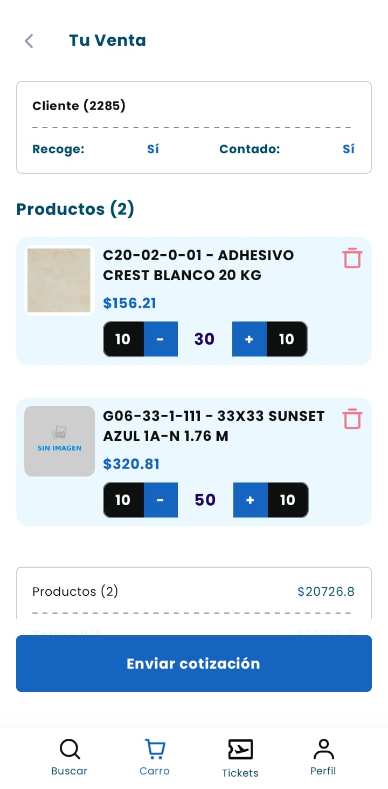
      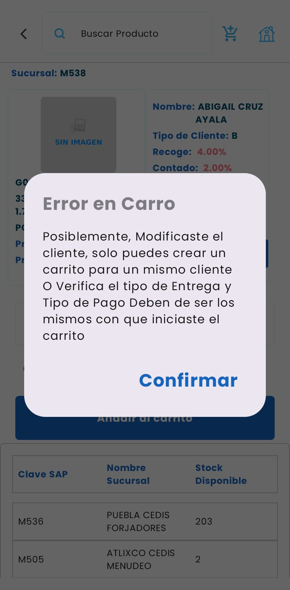
        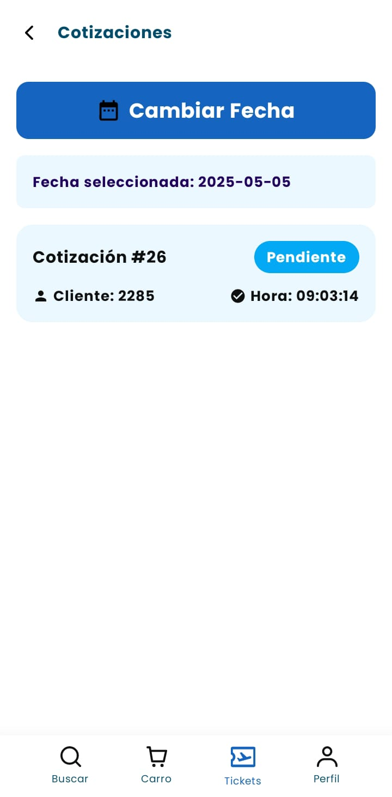
          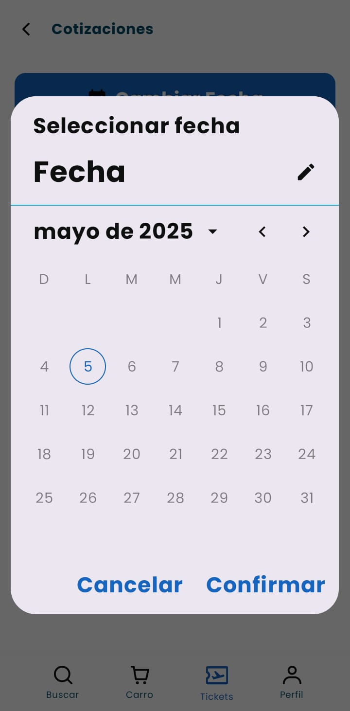
            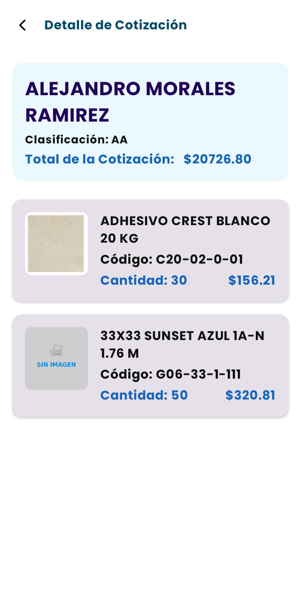
              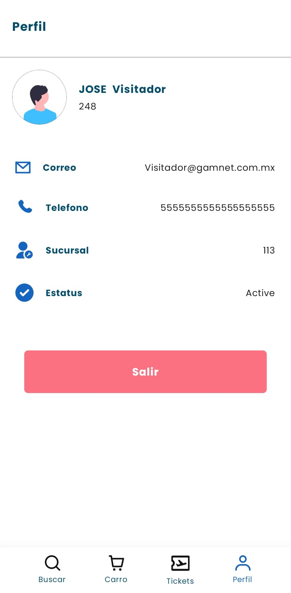
                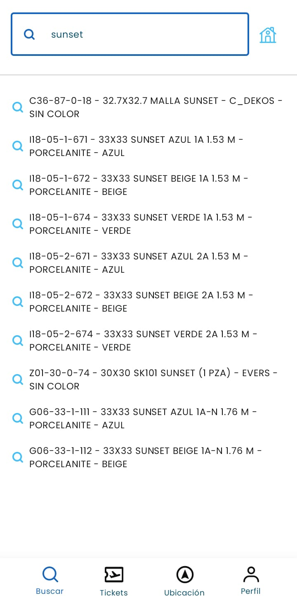

### 🧑🏻‍💻 Documentación de la Aplicación

La documentación del código fuente de la aplicación ha sido generada utilizando **Dokka**, la herramienta de documentación para Kotlin de JetBrains. Esta documentación proporciona una visión detallada de las clases, interfaces, funciones y propiedades del proyecto, incluyendo explicaciones sobre su propósito, parámetros y valores de retorno.

**Ruta de la Documentación:** [`GAM/dokka/html`](dokka/html)

Para acceder a la documentación, navegue https://davidretur.github.io/DocumentacionGam.github.io/ en su navegador web.

### 🧑🏻‍💻 Tecnologías Utilizadas

* **Kotlin:** Lenguaje de programación principal [Kotlin](https://kotlinlang.org).
* **Jetpack Compose:** Framework moderno para construir interfaces de usuario nativas en Android [Jetpack Compose](https://developer.android.com/jetpack/compose).
* **Android DataStore:** Solución de almacenamiento de datos persistente y segura [DataStore](https://developer.android.com/topic/libraries/architecture/datastore).
* **Hilt:** Librería de inyección de dependencias para Android [Hilt](https://dagger.dev/hilt/).
* **Retrofit:** Librería para realizar llamadas a la API RESTful [Retrofit](https://square.github.io/retrofit/).
* **Kotlin Coroutines y Flows:** Para la gestión de tareas asíncronas y flujos de datos [Coroutines](https://kotlin.github.io/kotlinx.coroutines/).

### Características Principales ✨

* **Autenticación de Usuarios:** Permite a los usuarios iniciar sesión de forma segura para acceder a las funcionalidades personalizadas de la aplicación.
* **Exploración y Búsqueda de Productos:** Los usuarios pueden navegar por el catálogo de productos y utilizar la función de búsqueda para encontrar artículos específicos.
* **Gestión del Carrito de Compras:** Permite agregar, eliminar y modificar la cantidad de productos en el carrito de compras.
* **Información del Cliente:** Los usuarios pueden acceder a información detallada de clientes mayoristas.
* **Información de Productos Detallada:** Muestra información completa de los productos, incluyendo detalles específicos para clientes.
* **Gestión de Ubicaciones:** Permite agregar y visualizar ubicaciones, posiblemente relacionadas con sucursales o clientes.
* **Histórico de Cotizaciones:** Los usuarios pueden consultar el historial de cotizaciones, con detalles a nivel de gerente y por visitador.
* **Interfaz de Usuario Moderna:** Desarrollada con Jetpack Compose, ofrece una interfaz de usuario nativa, reactiva y visualmente atractiva.
* **Navegación Intuitiva:** Utiliza una barra de navegación inferior para facilitar el acceso a las diferentes secciones de la aplicación, adaptándose al rol del usuario.
* **Carga de Imágenes Asíncrona:** Implementa la carga eficiente de imágenes desde la red utilizando la librería Coil, con soporte para placeholders y manejo de errores.
* **Indicadores de Carga:** Incorpora un efecto de shimmer animado y animaciones de Lottie para proporcionar una experiencia de usuario fluida durante las operaciones de carga.
* **Persistencia de Datos:** Utiliza DataStore para almacenar de forma segura datos clave de la aplicación, como el estado de inicio de sesión y el token del usuario.
* **Inyección de Dependencias:** Emplea Hilt para una gestión eficiente y organizada de las dependencias en toda la aplicación.
* **Manejo de Estados con Flows y Recursos:** Utiliza Kotlin Flows y una clase de Recurso para gestionar el estado de las operaciones de red y la presentación de datos.
* **SplashScreen Personalizada:** Implementa una pantalla de presentación para mejorar la experiencia de inicio de la aplicación.

